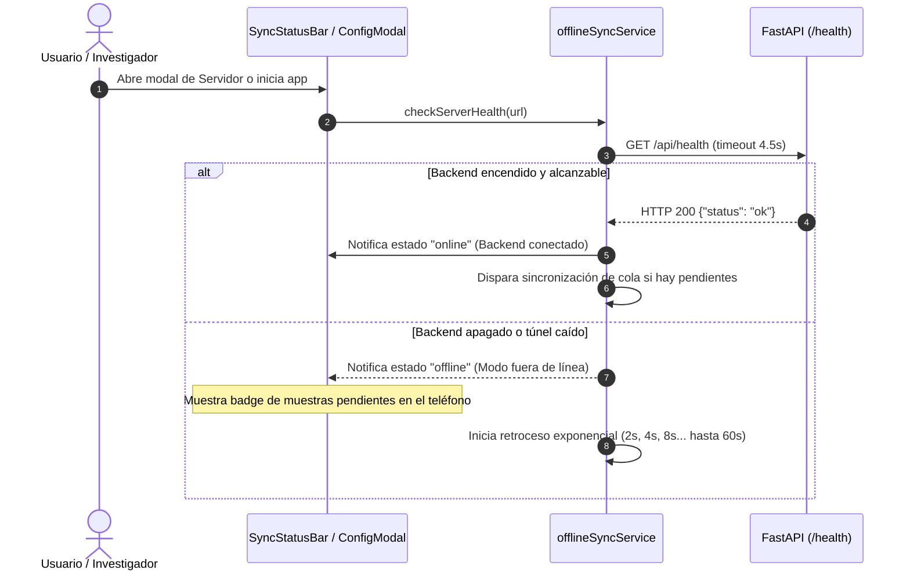
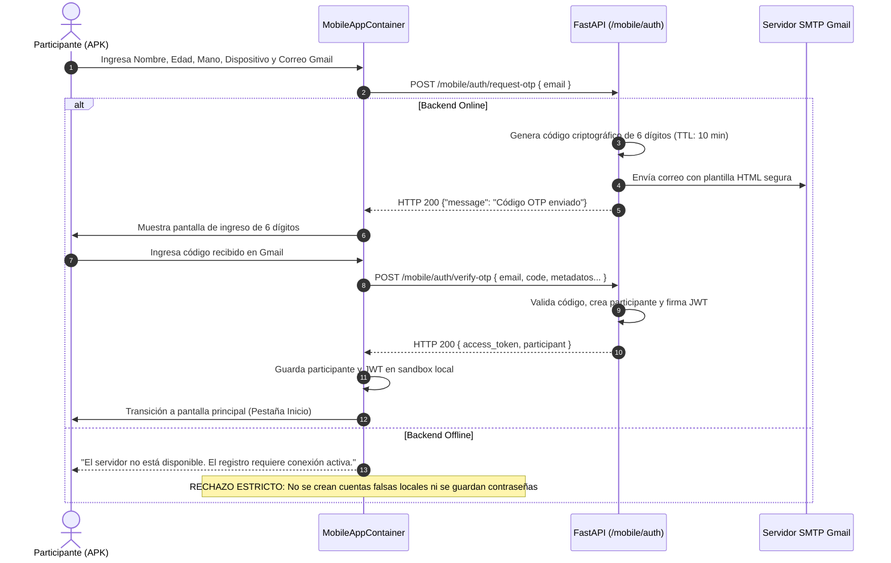
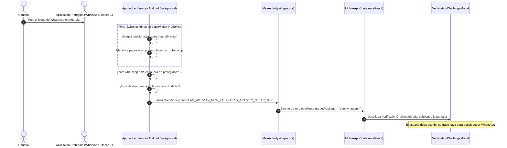
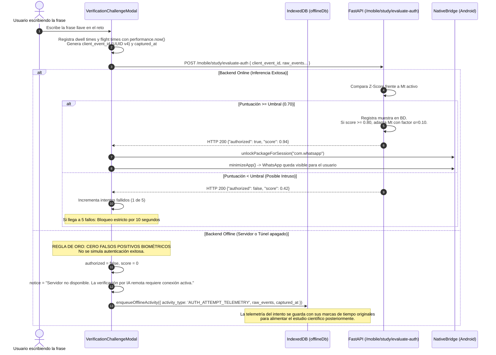
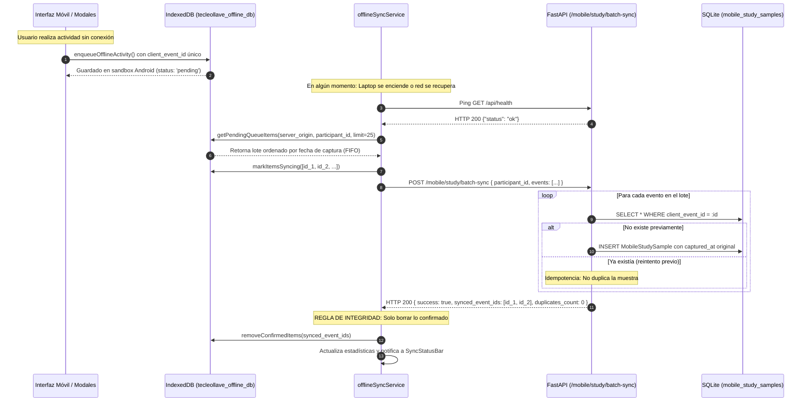
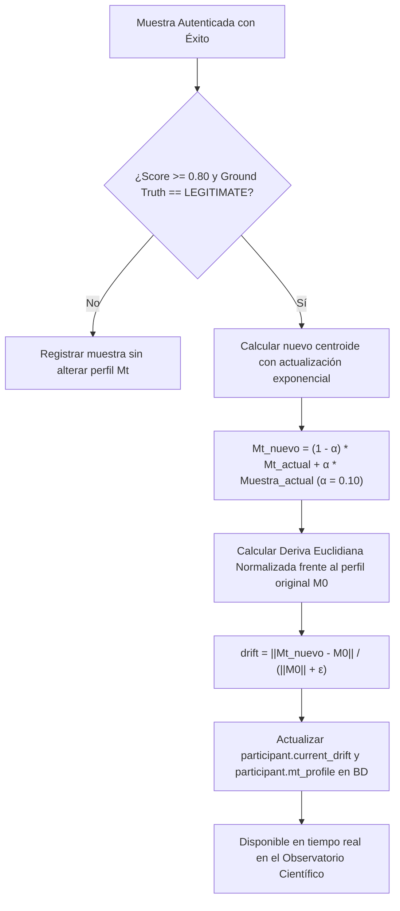

# Arquitectura y Flujo Integral del Sistema TECLEOLLAVE-ADAPT

Este documento describe la arquitectura, los componentes y los flujos de datos y control que rigen el funcionamiento del sistema **TECLEOLLAVE-ADAPT** en su versión actual. Abarca tanto el entorno de investigación web (Observatorio Científico) como el cliente móvil nativo (APK Android en Capacitor 8), la supervisión en segundo plano (**AppLocker**), el motor biométrico adaptativo y la arquitectura de captura local y sincronización offline idempotente.

---

## 1. Visión General y Propósito del Sistema

**TECLEOLLAVE-ADAPT** es una plataforma de ciberseguridad e investigación científica enfocada en la **Autenticación Biométrica Conductual Continua mediante Dinámica de Tecleo (*Keystroke Dynamics*)**.

El objetivo central es validar si el ritmo temporal intrínseco con el que una persona escribe una frase predeterminada (frase llave) permite distinguirla fehacientemente de intrusos e impostores, adaptándose al mismo tiempo a la evolución natural o fatiga del usuario legítimo sin degradar la tasa de error.

El ecosistema está compuesto por tres subsistemas interconectados:
1. **Cliente Móvil (APK Android / Capacitor 8):** Aplicación híbrida de alto rendimiento instalada en los teléfonos de los participantes. Incluye el teclado y pantalla de captura, supervisión de aplicaciones del sistema (*AppLocker*), almacenamiento local aislado (IndexedDB) y cliente de sincronización tolerante a fallos.
2. **Backend de Servicios e Inferencia (FastAPI + SQLite):** Servidor central que gestiona el registro mediante códigos OTP vía Gmail, orquesta el pipeline de Machine Learning (perfiles $M_0$ y $M_t$), evalúa los intentos de acceso, almacena la telemetría del estudio de forma idempotente y expone la API REST.
3. **Observatorio Científico y Consola Web (React 18 + Vite):** Panel administrativo para los investigadores que permite monitorizar en tiempo real el progreso de los participantes, la deriva biométrica (*drift*), métricas de rendimiento (FAR, FRR, EER), curvas ROC y exportación de datos.

---

## 2. Diagrama de Arquitectura Global End-to-End

```
+-----------------------------------------------------------------------------------+
|                            ENTORNO MÓVIL (TELÉFONO ANDROID)                       |
|                                                                                   |
|  +-----------------------------------------------------------------------------+  |
|  |  Servicio Nativo Android (AppLockerService - Foreground Service)            |  |
|  |  - Monitor de aplicaciones en primer plano (UsageStatsManager)              |  |
|  |  - Detección de paquetes objetivo (WhatsApp, BCP, Yape, etc.)              |  |
|  |  - Lanzamiento forzado de MainActivity al detectar app protegida            |  |
|  +-----------------------------------------------------------------------------+  |
|                                         │ (Intents / Eventos de reto)             |
|                                         ▼                                         |
|  +-----------------------------------------------------------------------------+  |
|  |  Capa Webview Local (React 18 + Capacitor 8)                                |  |
|  |  - Captura precisa con performance.now() (KeyDown / KeyUp)                  |  |
|  |  - Bloqueo Maestro de TECLEOLLAVE y Verificación de Retos de Apps           |  |
|  |  - Enrolamiento Guiado de 30 Repeticiones con Pausas Anti-Fatiga            |  |
|  |  - SyncStatusBar: Estados (Online, Offline, Cola Pendiente, Sincronizando)   |  |
|  +-----------------------------------------------------------------------------+  |
|                 │                                              │                  |
|   (Si está      │                                (Si está      │                  |
|    Offline)     ▼                                 Online)      ▼                  |
|  +-------------------------------+             +-------------------------------+  |
|  | Base de Datos IndexedDB       |             | Cliente API Axios             |  |
|  | - tecleollave_offline_db      |             | - dynamic baseURL (túnel/LAN) |  |
|  | - sandbox privado app_webview |             | - Bearer JWT Token            |  |
|  | - client_event_id (UUID v4)   |             +-------------------------------+  |
|  | - tiempos de captura intactos |                             │                  |
|  +-------------------------------+                             │                  |
|                 ▲                                              │                  |
|                 │ Sincronización automática cuando             │                  |
|                 └── el backend vuelve a estar disponible       │                  |
+----------------------------------------------------------------│------------------+
                                                                 │ HTTPS
                                  Internet / Red Local           │ (Túnel Cloudflare
                                 (o Laptop encendida)            │  o IP Pública)
                                                                 ▼
+-----------------------------------------------------------------------------------+
|                        BACKEND CENTRAL (FASTAPI + SQLITE)                         |
|                                                                                   |
|  +-----------------------------------------------------------------------------+  |
|  | API Router (/api)                                                           |  |
|  |  - /health : Diagnóstico y verificación de disponibilidad activa            |  |
|  |  - /mobile/auth/request-otp & /verify-otp : Registro central vía Gmail      |  |
|  |  - /mobile/study/enroll-30 : Calibración de perfil base M0 (30 reps)         |  |
|  |  - /mobile/study/evaluate-auth : Inferencia Z-score vs Mt + Idempotencia    |  |
|  |  - /mobile/study/batch-sync : Consumo masivo e idempotente de colas offline |  |
|  |  - /mobile/study/satisfaction : Registro de encuestas SUS / Usabilidad       |  |
|  +-----------------------------------------------------------------------------+  |
|                 │                                              │                  |
|                 ▼                                              ▼                  |
|  +-------------------------------+             +-------------------------------+  |
|  | Motor Biométrico Adaptativo   |             | Base de Datos SQLite          |  |
|  | - Vectores Dwell (HT) y       |             | - tecleollave.db              |  |
|  |   Flight (LT)                 |             | - Tabla mobile_participants   |  |
|  | - Perfiles M0 y Mt            |             | - Tabla mobile_study_samples  |  |
|  | - Actualización online α=0.10 |             |   (con client_event_id UNIQUE)|  |
|  | - Medición de Deriva (drift)  |             | - Tablas de auditoría y users |  |
|  +-------------------------------+             +-------------------------------+  |
+-----------------------------------------------------------------------------------+
                                          ▲
                                          │ HTTPS (Token Admin)
+-----------------------------------------│-----------------------------------------+
|                  OBSERVATORIO CIENTÍFICO WEB (INVESTIGADORES)                     |
|                                                                                   |
|  - Dashboard de monitoreo en tiempo real de participantes y telemetría móvil      |
|  - Seguimiento de consistencia, deriva (drift) y métricas de error (FAR / FRR)   |
|  - Análisis sociodemográfico (edad, mano dominante, tasa de refresco)            |
|  - Exportación de datos de investigación a CSV, Excel y PDF                       |
+-----------------------------------------------------------------------------------+
```

---

## 3. Flujo 1: Conectividad, Detección de Salud y Configuración de Servidor

Dado que el backend se ejecuta en la laptop del investigador y se expone a internet a través de un túnel temporal (por ejemplo, Cloudflare Tunnel), la conectividad puede variar dinámicamente cuando la laptop se enciende, se apaga o el túnel cambia de URL.



### Características Técnicas del Flujo:
1. **Fallback dinámico de URL en el Frontend:** En [`api.js`](file:///run/media/pandaman/Datos1/UNT/4to%20A%C3%91O/VIII/Seguridad%20de%20la%20Informaci%C3%B3n/TecleoLlave-Adapt/frontend/src/services/api.js), `getBaseUrl()` evalúa primero si existe una URL guardada en `localStorage.getItem('tl_server_url')`. Si no existe, recurre a `import.meta.env.VITE_API_URL` o `/api`.
2. **Reconfiguración en Caliente:** A través de [`ServerConfigModal.jsx`](file:///run/media/pandaman/Datos1/UNT/4to%20A%C3%91O/VIII/Seguridad%20de%20la%20Informaci%C3%B3n/TecleoLlave-Adapt/frontend/src/components/mobile/ServerConfigModal.jsx), el usuario puede pegar la nueva URL del túnel. Al pulsar *Guardar y Probar*, la aplicación ejecuta un ping a `${url}/api/health`. Solo si responde `status: 'ok'` se guarda la nueva URL, actualizando inmediatamente `api.defaults.baseURL` sin necesidad de reinstalar el APK.
3. **Aislamiento de Colas por Servidor:** Cada muestra encolada localmente almacena el campo `server_origin` normalizado. Si se cambia de servidor, las muestras de la cola quedan asociadas a su origen original, evitando subir accidentalmente datos al servidor equivocado.

---

## 4. Flujo 2: Registro de Participantes y Autenticación Centralizada (Onboarding)

El sistema establece que **el servidor central es la única autoridad de cuentas e identidad**.



### Reglas de Seguridad en Registro:
- **Prohibición de Cuentas Falsas Offline:** Si el backend está apagado, la aplicación rechaza explícitamente el intento de creación de cuenta o inicio de sesión. Nunca se generan "cuentas locales simuladas" que luego causen inconsistencias de identidad.
- **Minimización de Credenciales:** La APK no utiliza contraseñas estáticas; utiliza autenticación OTP por correo electrónico con tokens de corta duración firmados con algoritmo HS256 (`access_token`).

---

## 5. Flujo 3: Enrolamiento Biométrico Guiado (Calibración del Perfil Base $M_0$)

Para poder reconocer la forma de escribir del usuario, el participante debe someterse a una calibración inicial de **30 repeticiones exactas** de su frase llave.

```mermaid
sequenceDiagram
    autonumber
    actor Usuario as Participante
    participant Modal as GuidedEnrollmentModal
    participant DBLocal as IndexedDB (offlineDb)
    participant SyncSvc as offlineSyncService
    participant Backend as FastAPI (/mobile/study/enroll-30)

    Usuario->>Modal: Inicia entrenamiento de frase llave
    Note over Modal: Paso 0: Presentación de la frase llave exacta<br/>Paso 1: Recomendaciones de postura y teclado nativo
    loop Repeticiones 1 a 30
        Usuario->>Modal: Escribe la frase en el campo de tecleo nativo
        Modal->>Modal: Captura en cada tecla: dwell_time (HT) y flight_time (LT) con performance.now()
        alt Repetición 10 o 20 alcanzada
            Modal->>Usuario: Activa Pausa Anti-Fatiga obligatoria (15 segundos)
        end
    end

    Modal->>Modal: Genera client_event_id (UUID v4) y captured_at
    alt Servidor Conectado (Online)
        Modal->>Backend: POST /mobile/study/enroll-30 { participant_id, phrase, repetitions }
        Backend->>Backend: Extrae vectores, calcula centroides y varianzas.<br/>Genera perfiles M0 y Mt inicial.
        Backend-->>Modal: HTTP 200 {"is_enrolled": true, "profile_preview": M0}
        Modal->>Usuario: Muestra Paso 3: ¡Perfil Biométrico Listo! (Online)
    else Servidor Inaccesible (Offline)
        Modal->>DBLocal: enqueueOfflineActivity({ activity_type: 'ENROLLMENT_30', repetitions, captured_at })
        Modal->>SyncSvc: updateStats()
        Modal->>Usuario: Muestra Paso 3: ¡Perfil Biométrico Listo! (Guardado en teléfono)
        Note over Usuario: La app activa la protección localmente; el lote de 30 muestras<br/>se subirá automáticamente al encender el backend.
    end
```

---

## 6. Flujo 4: Supervisión en Segundo Plano y Bloqueo Nativo (*AppLocker*)

Una vez que el usuario tiene su frase calibrada, el servicio nativo de Android garantiza que las aplicaciones protegidas no puedan ser abiertas sin superar el reto biométrico.



### Bloqueo Maestro de la propia APK TECLEOLLAVE:
- Al abrir la aplicación TECLEOLLAVE, o al volver a ella tras bloquearse la pantalla del teléfono (`appStateChange`), la aplicación se auto-bloquea exigiendo la frase llave para acceder a las pestañas de administración y configuración de apps.

---

## 7. Flujo 5: Desafío de Verificación y Evaluación Biométrica por IA

Cuando se dispara el reto de desbloqueo, el usuario debe escribir su frase llave. El sistema extrae la dinámica temporal de sus dedos y evalúa si coincide con el perfil del legítimo dueño.



---

## 8. Flujo 6: Persistencia Local, Cola Offline y Sincronización Idempotente

Cuando el backend de la laptop o el túnel está apagado, la APK móvil continúa capturando actividades locales (enrolamientos de 30 repeticiones, telemetría de intentos de autenticación, encuestas de satisfacción) y las almacena en la base de datos **IndexedDB**.



### Garantías de Seguridad e Idempotencia:
1. **Identificadores Únicos en Cliente (`client_event_id`):** Cada evento genera un UUID v4 criptográfico al capturarse. La columna `client_event_id` en la tabla `mobile_study_samples` de SQLite tiene una restricción `UNIQUE` e índice dedicado.
2. **Preservación Temporal Estricta:** El backend extrae la propiedad `captured_at` del evento y la asigna a la columna `created_at` de SQLite. La hora en que se sincronizó no sobreescribe la hora real en que el usuario presionó las teclas en su teléfono.
3. **Manejo de Respuestas Parciales:** Si un lote de 25 elementos se interrumpe tras guardar 10, la próxima sincronización re-envía la cola; el backend detecta los 10 primeros como duplicados inocuos (`duplicates_count`) y persiste los 15 restantes sin pérdida ni duplicidad.
4. **Manejo de Sesión Expirada (401/403):** Si el token JWT caduca mientras hay muestras en la cola, el servicio de sincronización entra en estado `auth_required` y pausa los envíos. **Bajo ninguna circunstancia se descarta la cola local ni se guardan contraseñas para reautenticar automáticamente**. La cola permanece protegida en IndexedDB hasta que el usuario inicie sesión online.

---

## 9. Flujo 7: Motor Adaptativo Continuo ($M_0 \rightarrow M_t$) y Deriva Biométrica

El comportamiento biomecánico de las manos de una persona evoluciona por fatiga, postura, crecimiento o familiaridad con el teclado. Para evitar que la tasa de falso rechazo (FRR) se dispare con el tiempo, el sistema implementa una **adaptación en línea controlada**:



### Formulación Matemática:
- **Vector de Características Temporales:** Para una frase con $K$ pulsaciones, se extraen los tiempos de sostenimiento $HT = [ht_1, ht_2, \dots, ht_K]$ y tiempos de vuelo o latencias $LT = [lt_1, lt_2, \dots, lt_{K-1}]$.
- **Similitud Mahalanobis / Z-Score:** Frente a los centroides $\mu_{HT}, \mu_{LT}$ y desviaciones $\sigma_{HT}, \sigma_{LT}$ del perfil activo $M_t$:
  $$z = \frac{1}{|HT| + |LT|} \left( \sum \left|\frac{ht_i - \mu_{ht, i}}{\sigma_{ht, i}}\right| + \sum \left|\frac{lt_j - \mu_{lt, j}}{\sigma_{lt, j}}\right| \right)$$
- **Score de Confianza:**
  $$S = e^{-z / 3.0} \in [0.05, 0.99]$$
  Si $S \ge \theta_{accept}$ ($0.70$), el intento se considera legítimo.

---

## 10. Flujo 8: Observatorio Científico y Plataforma de Investigación Web

Para que los investigadores de la tesis y estudio puedan auditar los datos recopilados por las APKs distribuidas, se cuenta con el **Observatorio Web**:

```
+---------------------------------------------------------------------------------+
|                    OBSERVATORIO CIENTÍFICO TECLEOLLAVE-ADAPT                    |
+---------------------------------------------------------------------------------+
|                                                                                 |
|  [ Métricas Globales del Estudio ]                                              |
|  - Total Participantes: 45      - Muestras Recopiladas: 1,350                   |
|  - Enrolados al 100%: 42        - Deriva Biométrica Promedio: 0.124             |
|                                                                                 |
|  +-----------------------------------+  +------------------------------------+  |
|  | Distribución Sociodemográfica     |  | Monitoreo de Deriva en Tiempo Real |  |
|  | - 18 a 25 años: 80%               |  | [ Gráfica de evolución temporal    |  |
|  | - 26 a 35 años: 15%               |  |   drift por participante ]         |  |
|  | - Diestros: 88% | Zurdos: 12%     |  |                                    |  |
|  +-----------------------------------+  +------------------------------------+  |
|                                                                                 |
|  +---------------------------------------------------------------------------+  |
|  | Tabla de Telemetría Detallada por Participante                            |  |
|  | Cód | Correo | Apps Protegidas | Muestras | Consistencia | Deriva | SUS   |  |
|  | P01 | part1@ | WhatsApp, BCP   | 30/30    | 92%          | 0.081  | 5/5   |  |
|  | P02 | part2@ | WhatsApp, Yape  | 30/30    | 86%          | 0.145  | 4/5   |  |
|  +---------------------------------------------------------------------------+  |
|                                                                                 |
|  [ Botones de Exportación Científica ]: [ Descargar CSV ] [ Excel ] [ Informe PDF ]|
+---------------------------------------------------------------------------------+
```

### Funcionalidades del Observatorio:
1. **Auditoría de Enrolamiento y Actividad:** Permite verificar qué participantes completaron sus 30 repeticiones y cuáles tienen lotes sincronizados recientemente.
2. **Matriz de Confusión y FAR / FRR:** Cálculo de la Tasa de Falso Rechazo (FRR, cuando el dueño es bloqueado) y Tasa de Falsa Aceptación (FAR, cuando un impostor intenta teclear la frase).
3. **Exportación Reproducible:** Genera reportes en CSV y Excel con los vectores crudos de latencias y tiempos de sostenimiento listos para procesamiento en Python/Pandas o R.

---

## 11. Resumen de Tecnologías y Componentes

| Capa | Componente / Archivo Principal | Rol y Responsabilidad |
| :--- | :--- | :--- |
| **Android Nativo** | [`AppLockerService.java`](file:///run/media/pandaman/Datos1/UNT/4to%20A%C3%91O/VIII/Seguridad%20de%20la%20Informaci%C3%B3n/TecleoLlave-Adapt/frontend/android/app/src/main/java/pe/edu/unt/tecleollave/AppLockerService.java) | Servicio en segundo plano para detección continua de apps con `UsageStatsManager`. |
| **Android Nativo** | [`AndroidSecurityBridgePlugin.java`](file:///run/media/pandaman/Datos1/UNT/4to%20A%C3%91O/VIII/Seguridad%20de%20la%20Informaci%C3%B3n/TecleoLlave-Adapt/frontend/android/app/src/main/java/pe/edu/unt/tecleollave/AndroidSecurityBridgePlugin.java) | Plugin Capacitor para consulta de permisos, paquetes instalados y desbloqueo temporal. |
| **Frontend Storage** | [`offlineDb.js`](file:///run/media/pandaman/Datos1/UNT/4to%20A%C3%91O/VIII/Seguridad%20de%20la%20Informaci%C3%B3n/TecleoLlave-Adapt/frontend/src/services/offlineDb.js) | Capa de persistencia IndexedDB tolerante a reinicios y cierres de la app. |
| **Frontend Sync** | [`offlineSyncService.js`](file:///run/media/pandaman/Datos1/UNT/4to%20A%C3%91O/VIII/Seguridad%20de%20la%20Informaci%C3%B3n/TecleoLlave-Adapt/frontend/src/services/offlineSyncService.js) | Orquestador de sincronización con ping `/health`, lotes de 25 y retroceso exponencial. |
| **Frontend UI** | [`MobileAppContainer.jsx`](file:///run/media/pandaman/Datos1/UNT/4to%20A%C3%91O/VIII/Seguridad%20de%20la%20Informaci%C3%B3n/TecleoLlave-Adapt/frontend/src/pages/mobile/MobileAppContainer.jsx) | Contenedor principal de la APK, bloqueo maestro, pestañas y modales. |
| **Frontend Reto** | [`VerificationChallengeModal.jsx`](file:///run/media/pandaman/Datos1/UNT/4to%20A%C3%91O/VIII/Seguridad%20de%20la%20Informaci%C3%B3n/TecleoLlave-Adapt/frontend/src/components/mobile/VerificationChallengeModal.jsx) | Modal de captura y verificación de la frase llave con tecleo nativo y rechazo honesto offline. |
| **Backend API** | [`mobile_study.py`](file:///run/media/pandaman/Datos1/UNT/4to%20A%C3%91O/VIII/Seguridad%20de%20la%20Informaci%C3%B3n/TecleoLlave-Adapt/backend/app/api/mobile_study.py) | Endpoints FastAPI para OTP, 30 repeticiones, inferencia remota y `batch-sync`. |
| **Backend Servicio** | [`mobile_study_service.py`](file:///run/media/pandaman/Datos1/UNT/4to%20A%C3%91O/VIII/Seguridad%20de%20la%20Informaci%C3%B3n/TecleoLlave-Adapt/backend/app/services/mobile_study_service.py) | Lógica de cálculo de similitud Z-score, adaptación online $\alpha=0.10$ e idempotencia de lotes. |
| **Backend Datos** | [`mobile_study.py` (Models)](file:///run/media/pandaman/Datos1/UNT/4to%20A%C3%91O/VIII/Seguridad%20de%20la%20Informaci%C3%B3n/TecleoLlave-Adapt/backend/app/models/mobile_study.py) | Modelos SQLAlchemy para participantes, códigos OTP y muestras con `client_event_id` único. |
| **Base de Datos** | SQLite (`tecleollave.db`) | Persistencia relacional local con soporte transaccional y auto-migración dinámica. |
| **Web Admin** | [`ObservatorioWeb.jsx`](file:///run/media/pandaman/Datos1/UNT/4to%20A%C3%91O/VIII/Seguridad%20de%20la%20Informaci%C3%B3n/TecleoLlave-Adapt/frontend/src/pages/admin/ObservatorioWeb.jsx) | Panel web de investigación, telemetría y exportación científica. |
